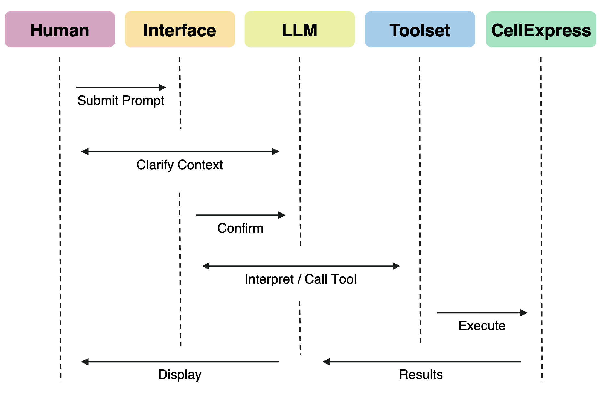

<p align="center">
  <a href="#"></a>
  <a href="#"></a>
  <a href="#"></a>
  <a href="https://github.com/langchain-ai/langgraph"></a>
  <a href="#"></a>
  <br>
  <a href="#"></a>
  <a href="#"></a>
  <a href="#"></a>
  <a href="#"></a>
  
  <br>
  <a href="https://github.com/azu-oncology-rd/cellatria/actions/workflows/docker.yml"></a>
  <br>
</p>

<!-- Version Banner -->
<p align="center" width="100%">  
  
</p>

<!-- CellAtria Infographic -->
<p align="center" width="100%">
   
</p>

---

## ✨ Introduction
<details>
<br>


**CellAtria** is an agentic AI system that enables **full-lifecycle, document-to-analysis automation** in single-cell research. It integrates natural language interaction with a robust, graph-based, multi-actor execution framework. The system orchestrates diverse tasks, ranging from literature parsing and metadata extraction to dataset retrieval and downstream scRNA-seq analysis via the co-developed [**CellExpress**](#cellexpress) pipeline.

> Through its comprehensive interface, **CellAtria** empowers users to engage with a language model augmented by task-specific tools. This eliminates the need for manual command-line operations, accelerating data onboarding and the reuse of public single-cell resources.

<p align="center" width="100%">
   
</p>
<p align="center">
  <small><em><strong>Language model-mediated orchestration of toolchains</strong>. Upon receiving a user prompt, the CellAtria interface transfers the request to the LLM agent, which interprets intent and autonomously invokes relevant tools. Outputs are returned through the interface, completing a full cycle of context-aware execution.</em></small>
</p>


</details>

---

## 💡 Key Features
<details>
<br>

- **Flexible Input**: Accepts primary research articles as **PDFs** or **URLs** for seamless integration.
- **Automated Metadata Extraction**: Accurately extracts structured metadata, including sample annotations, organism, tissue type, and GEO (Gene Expression Omnibus) accession identifiers.
- **Intelligent Data Retrieval**: Resolves and organizes GEO datasets by accessing both **GSE (study-level)** and **GSM (sample-level)** records, ensuring structured and comprehensive data retrieval.
- **Integrated Analysis Pipeline**: Orchestrates full pipeline configuration and launches [**CellExpress**](#cellexpress), a containerized framework for standardized scRNA-seq analysis, ensuring reproducible results.
- **Enhanced User Control**: Enables metadata editing, secure file transfers, and direct file system management within the agent session.
- **Modular & Reusable Architecture**: Composes all core actions into reusable, graph-based tools that serve as callable agent nodes, fostering extensibility.

> Additional details on the underlying toolkits can be found in the [toolkit reference](https://github.com/azu-oncology-rd/cellatria/blob/main/agent/toolkit.md)

</details>

---

## 🚀  Getting Started
<details>

### (1) Prerequisites

- **Docker**: Install [Docker](https://docs.docker.com/get-docker/) and ensure the Docker daemon is running.
- **Environment Configuration**: Provide a `.env` file with credentials and parameters (see [LLM Configuration](#env_setup) section below).

---

### (2) Docker Images

The **CellAtria** repository includes a GitHub Actions workflow that builds and publishes a preconfigured Docker image to the [GitHub Container Registry](https://github.com/azu-oncology-rd/cellatria/pkgs/container/cellatria).

Pull the latest **CellAtria** Docker image using:

```bash
# Run this command in your terminal
docker pull ghcr.io/azu-oncology-rd/cellatria:v1.0.0
```

> This image contains all dependencies needed to run  the **CellAtria** agent in a consistent environment.

---

### (3)  Launching Agent
Start the agent with the following command (replace paths with your actual directories):

```bash
# Run this command in your terminal
docker run -it --rm \
  -p 7860:7860 \
  -v /path/to/your/project/directory:/data \
  -v /path/to/your/env/directory:/envdir \
  ghcr.io/azu-oncology-rd/cellatria:v1.0.0 cellatria \
  --env_path /envdir
```

Command Breakdown:

- `-p 7860:7860`: Exposes the agent user interface (UI) on port 7860.
- `-v /path/to/your/project/directory:/data`: Mounts your project directory into the container.
- `-v /path/to/your/env/directory:/envdir`: Mounts your `.env` directory for configuration (see [LLM Configuration](#env_setup) section below).
- `ghcr.io/azu-oncology-rd/cellatria:v1.0.0 cellatria`: Specifies the Docker image and the entrypoint command to launch the app inside the container.
- `--env_path /envdir`: Tells agent where to find the `.env` file for provider setup.

> macOS users with Apple Silicon (M1/M2): You may encounter a warning due to platform mismatch. To ensure compatibility, add `--platform=linux/amd64` when running the container (i.e., `docker run --platform=linux/amd64 -it --rm`). 

> Once launched, the agent will initialize and provide a local URL for interaction. Simply open the link printed in your terminal to begin using CellAtria through your browser.

---

**Mounting a Working Directory:**

When running the container, any host directory you want the container to access must be explicitly mounted using Docker’s `-v` (volume) flag. The container can only see and interact with the directories you specify at runtime.

For example, the following command:

```bash
-v /absolute/path/on/host:/data
```

makes the contents of `/absolute/path/on/host` on your host machine available inside the container at `/data`.

> If you set a working directory inside the container (e.g., `my_project`), make sure to reference it using the container’s path — for instance: `/data/my_project`.

> Attempting to access files or directories outside the mounted path from within the container will fail, as they are not visible to the container’s filesystem.

</details>

---

<a name="env_setup"></a>
## 🛠️ LLM Configuration

<details>

### Quick Start

CellAtria requires a `.env` file to configure access to your chosen LLM provider. You can download the template [`.env`](https://github.com/azu-oncology-rd/cellatria/blob/main/.env), fill in the necessary credentials and parameters. Ensure the directory containing the `.env` file is mounted into the container.

### Supported LLM Backends

- `azure`: Azure OpenAI (enterprise-grade access to GPT models)
- `openai`: Standard OpenAI API (e.g., GPT-4, GPT-3.5)
- `anthropic`: Claude models via the Anthropic API
- `google`: Gemini models via Google Cloud / Vertex AI
- `local`: Offline models (e.g., Llama.cpp, Ollama, Hugging Face)

> Set the `PROVIDER` variable in your `.env` file to one of the supported values above. Only one provider can be active at a time. 

> You only need to configure the block for the provider you're using. The rest can remain commented.

</details>

---

<a name="cellexpress"></a>
## 🚂 CellExpress Engine
<details>
<br>

**CellExpress** is a companion pipeline embedded within the **CellAtria** framework. It delivers a reproducible and automated workflow for processing single-cell RNA-seq datasets (scRNA-seq) - from raw count matrices to comprehensive cell type annotations and report generation.

> Designed to lower bioinformatics barriers, **CellExpress** implements a comprehensive set of state-of-the-art, Scanpy-based processing stages, including quality control (performed globally or per sample), data transformation (including normalization, highly variable gene selection, and scaling), dimensionality reduction (UMAP and t-SNE), graph-based clustering, and marker gene identification. Additional tools are integrated to support advanced analysis tasks, including doublet detection, batch correction, and automated cell type annotation using both tissue-agnostic and tissue-specific models. All analytical steps are executed sequentially under centralized control, with parameters fully configurable via a comprehensive input schema. 

---

### Run CellExpress in Standalone Mode

**CellExpress** is a fully standalone pipeline for comprehensive scRNA-seq data analysis. It can be orchestrated either through an agentic system - as incorporated into the **CellAtria** framework - or via direct command-line execution.

To execute the CellExpress pipeline directly using Docker, use the following command:

```bash
# Run this command in your terminal
docker run -it --rm \
  -v /path/to/your/local/data:/data \
  ghcr.io/azu-oncology-rd/cellatria:v1.0.0 cellexpress \
    --input /data \
    --project your_project_name \
    --species `species` \
    --tissue `tissue` \
    --disease `disease` \
    [--additional `options`...]
```

Command Breakdown:

- `-v /path/to/your/local/data:/data`: Mounts your project directory into the container.
- `ghcr.io/azu-oncology-rd/cellatria:v1.0.0 cellexpress`: Specifies the Docker image and the entrypoint command to launch **CellExpress** inside the container.
-  [--additional `options`...]: arguments to configure pipeline.

> macOS users with Apple Silicon (M1/M2): You may encounter a warning due to platform mismatch. To ensure compatibility, add `--platform=linux/amd64` when running the container (i.e., `docker run --platform=linux/amd64 -it --rm`). 

> For full details, usage instructions, and configuration options, refer to the [CellExpress README](https://github.com/azu-oncology-rd/cellatria/blob/main/cellexpress/README.md).

</details>

---

## 🛠️ Computing Environment

<details>
<br>

The `Dockerfile` defines the dedicated computing environment for executing **cellatria** and the co-developed **CellExpress** pipelie in a consistent and reproducible manner. 
It includes all required Python and R dependencies, along with support for HTML reporting and visualization. 
Built on an Ubuntu-based system, the environment also provides essential system-level packages to support end-to-end 
pipeline execution. 

</details>

---

## 🧠 Usage Intuition
<details>
<br>

While **CellAtria** supports flexible, user-driven interactions, its functionality is governed by an underlying **execution narrative** — a structured flow of modular actions that define how tasks are interpreted, routed, and executed. Users may invoke any module independently; however, for optimal results and seamless orchestration, we recommend following the intended workflow trajectory below.

**CellAtria's internal logic integrates the following key stages:**

1.  **Document Parsing** - Extracts structured metadata from narrative-formatted scientific documents (article URL or PDF).
2.  **Accession Resolution** - Identifies relevant GEO (Gene Expression Omnibus) accession IDs from parsed metadata.
3.  **Dataset Retrieval** - Downloads datasets directly from public repositories.
4.  **File & Data Organization** - Structures downloaded content into a consistent directory schema for analysis.
5.  **Pipeline Configuration** - Prepares **CellExpress** arguments and environmental parameters for execution.
6.  **CellExpress Execution** - Launches the standardized single-cell analysis pipeline in a detached mode. 

> This modular, agent-guided framework allows users to begin at any point while preserving logical consistency across steps.

</details>

---

## 📬 Contact

<details>
<br>

| Role         | Name               | Contact                                     |
|--------------|--------------------|---------------------------------------------|
| Author/Maintainer   | Nima Nouri         | [nima.nouri@astrazeneca.com](mailto:nima.nouri@astrazeneca.com) | 

</details>

---