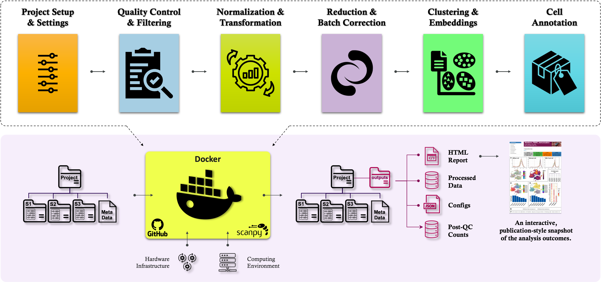

# CellExpress

<p align="center" width="100%">
   
</p>

---

## 💡 Introduction

<details>
<br>

**CellExpres** is an automated and versatile workflow meticulously designed to 
simplify and expedite the standard procedures entailed in scRNA-seq analysis, 
eliminating the need for specialized bioinformatics expertise. It encompasses 
various crucial steps in scRNA-seq analysis, starting from the aligned count matrices, 
followed by quality control, doublet removal, normalization, batch correction, dimensionality 
reduction, clustering, identification of cell markers, and cell type annotation. 
CellExpress Docker-based framework ensures reproducibility of results across diverse computing environments.

</details>

---

<a name="inputs"></a>
## 📂 Input Folder Structure

<details>
<br>

### **Metadata File (Required)**  
A file named `metadata.csv` must be present in the input directory and contain relevant **demographic** and **experimental** metadata.

- **Mandatory Column:**  
  - `sample`: Represents the **sample name** and must match the corresponding folder names exactly.
<br><br>

- **Additional Notes:**  
  - Each row in the metadata file should correspond to one sample.  
  - Include columns for demographic details, disease annotations, or experimental variables.  
  - `sample_id` is a **reserved keyword** used internally by the pipeline — do **not** include this column manually.


Example of a `metadata.csv` structure

```
| sample   | tissue | disease | time_point |
|----------|--------|---------|------------|
| sample_1 | lung   | asthma  | T1         |
| sample_2 | lung   | control | T2         |
```

---

### **Supported Input Data Formats**

**CellExpress** supports multiple input types for each sample:

- **10X Genomics Cell Ranger Output:**  
  - Standard 3-file output:  
    - `matrix.mtx.gz` (UMI count matrix)  
    - `barcodes.tsv.gz` (cell barcodes)  
    - `features.tsv.gz` or `genes.tsv.gz` (gene annotations)
<br><br>

- **HDF5 Format (`.h5`):**  
  - HDF5 files generated by the Cell Ranger pipeline  
    - Example: `filtered_feature_bc_matrix.h5`
<br><br>

- **AnnData Object (`.h5ad`):**  
  - Preprocessed `.h5ad` files  
  - 📍**Note:** Only **one `.h5ad` file per sample folder** is supported

---

### Organizational Requirements

- Each **sample must have its own subfolder** inside the input directory.  
- Folder names **must exactly match** the values listed in the `sample` column of `metadata.csv`.

An illustration of input data schema:

```
inputs
├── <sample_1>
|   ├── matrix.mtx.gz
|   ├── features.tsv.gz
|   └── barcodes.tsv.gz
└── <sample_2>
|   ├── matrix.mtx.gz
|   ├── features.tsv.gz
|   └── barcodes.tsv.gz
└── metadata.csv
```

</details>

---

<a name="pipe-args"></a>
## ⚙️ Pipeline Arguments

<details>
<br>

### 🔹 General Arguments

| Argument | Required | Type | Description |
|----------|----------|------|-------------|
| `--input` | ✅ | `str` | Path to the input directory containing sample folders and `metadata.csv`. |
| `--project` | ✅ | `str` | Project name to tag outputs and reports. |
| `--species` | ✅ | `str` | Organism species: `hs` for human or `mm` for mouse. Determines how mitochondrial genes are identified. |
| `--tissue` | ✅ | `str` | Tissue name. |
| `--disease` | ✅ | `str` | Disease name. |

📍 **Note**: To ensure consistency and compliance with data governance:

- The `--input` path must be an absolute path (e.g., `/mnt/data/CTPM-CellExpress/projects/my_project`)
- No trailing slashes (`/` or `\\`)
- The directory must exist

---

### 🧪 Quality Control (QC) Arguments

| Argument | Type | Default | Description |
|----------|------|---------|-------------|
| `--min_umi_per_cell` | `int` | 750 | Minimum total UMI counts per cell. |
| `--max_umi_per_cell` | `int` | `None` | Maximum total UMI counts per cell. |
| `--min_genes_per_cell` | `int` | 250 | Minimum number of genes per cell. |
| `--max_genes_per_cell` | `int` | `None` | Maximum number of genes per cell. |
| `--min_cell` | `int` | 3 | Genes must be expressed in at least this many cells. |
| `--max_mt_percent` | `float` | 15 | Maximum allowed percentage of mitochondrial gene expression per cell. |
| `--doublet_method` | `str` | `None` | Doublet detection method: currently supports [`scrublet`](https://github.com/swolock/scrublet). |
| `--scrublet_cutoff` | `float` | 0.25 | Threshold above which cells are considered doublets (if using `scrublet`). |

📍 **Sample-Based Quality Control (QC)**

When sample-based QC is required, all QC thresholds can be overridden on a **per-sample basis** using the `metadata.csv` file.  
In this case, the command-line values serve as **global defaults**, but will be **overwritten** by any per-sample values defined in the metadata.

Each sample's thresholds can be specified using the following **optional columns**:

| Column Name          | Description                                                              |
|----------------------|--------------------------------------------------------------------------|
| `min_umi_per_cell`   | Per-sample minimum UMI count.                                            |
| `max_umi_per_cell`   | Per-sample maximum UMI count.                                            |
| `min_genes_per_cell` | Per-sample minimum number of detected genes.                             |
| `max_genes_per_cell` | Per-sample maximum number of detected genes.                             |
| `min_cell`           | Minimum number of cells a gene must be expressed in.                     |
| `max_mt_percent`     | Maximum allowed percentage of mitochondrial gene expression per cell.    |

- Entries like `""`, `"NA"`, `"NaN"`, and `"N/A"` are **not allowed** and will raise an error.
- All values must be **valid numbers** (e.g., `0`, `1000`, `0.05`).
- Use `"None"` (case-insensitive) to indicate no value:
  - For `max_` thresholds, `"None"` is interpreted as `Inf` (no upper limit).
- `"None"` is **not allowed** for `min_` thresholds.

Example metadata file with sample-based QC:

```
| sample   | tissue | disease | min_umi_per_cell | max_umi_per_cell | min_genes_per_cell | max_genes_per_cell | min_cell | max_mt_percent |
|----------|--------|---------|------------------|------------------|--------------------|--------------------|----------|----------------|
| sample_1 | lung   | asthma  | 1000             | 25000            | 300                | 7500               | 10       | 12.5           |
| sample_2 | lung   | control | 1200             | None             | 250                | 5000               | 15       | 10.0           |
```

---

### 🔬 Analysis Arguments

| Argument | Type | Default | Description |
|----------|------|---------|-------------|
| `--norm_target_sum` | `float` | 1e4 | Target sum of UMIs per cell for normalization. |
| `--n_top_genes` | `int` | 2000 | Number of highly variable genes to select. |
| `--regress_out` | `str` | `no` | Regress out total counts and mitochondrial percentage (`yes`/`no`). |
| `--scale_max_value` | `float` | 10 | Clip (truncate) to this value after scaling. |
| `--n_pcs` | `int` | 30 | Number of principal components to retain for PCA. |
| `--batch_correction` | `str` | `None` | Batch correction method: currently supports [`harmony`](https://github.com/slowkow/harmonypy). |
| `--batch_vars` | `str` | `None` | Comma-separated obs columns to use for batch correction. |
| `--n_neighbors` | `int` | 15 | Number of neighbors for graph construction. |
| `--resolution` | `float` | 0.6 | Resolution parameter for Leiden clustering. |
| `--compute_tsne` | `str` | `no` | Whether to compute t-SNE embedding (`yes`/`no`). |

📍 **Note:** `--regress_out` is recommended for smaller datasets (<20k cells) where technical noise could distort biological signals. Consider enabling this if your data comes from different platforms, batches, or protocols with variable sequencing depth. For larger datasets, skipping this step significantly improves speed and reduces memory usage."

---

### 🏷️ Annotation Arguments

| Argument | Type | Default | Description |
|----------|------|---------|-------------|
| `--annotation_method` | `str` | `None` | Comma-separated list of annotation methods: cross-tissue [`scimilarity`](https://github.com/Genentech/scimilarity) and tissue-specific [`celltypist`](https://github.com/Teichlab/celltypist). |
| `--sci_model_path` | `str` | `None` | Path to SCimilarity model directory (if used). |
| `--cty_model_path` | `str` | `None` | Path to directory containing CellTypist `.pkl` models. |
| `--cty_model_name` | `str` | `None` | [CellTypist](https://www.celltypist.org/models) model name (without `.pkl` extension). Example: `Immune_All_High`. |

---

### 📊 Differential Expression (DE) Arguments

| Argument | Type | Default | Description |
|----------|------|---------|-------------|
| `--pval_threshold` | `float` | 0.05 | FDR-adjusted p-value threshold. |
| `--logfc_threshold` | `float` | 0.25 | Minimum log fold change to retain gene. |
| `--dea_method` | `str` | `wilcoxon` | marker genes identification method: `wilcoxon`, `t-test`, `logreg`, etc. |
| `--pts_threshold` | `float` | 0.1 | Minimum fraction of cells expressing a gene for it to be considered a marker. |
| `--top_n_deg_leidn` | `int` | 100 | Number of marker genes per Leiden cluster. If set to 0, skip.|
| `--top_n_deg_scim` | `int` | 100 | Number of marker genes per SCimilarity cell state. If set to 0, skip.|
| `--top_n_deg_cltpst` | `int` | 100 | Number of marker genes per CellTypist cell state. If set to 0, skip.|

---

### 🧾 Additional Options

| Argument | Type | Default | Description |
|----------|------|---------|-------------|
| `--paper_url` | `str` | `None` | Link to associated documentation. |
| `--data_url` | `str` | `None` | Link to dataset. |
| `--only_qc` | `str` | `no` | Set to `yes` to only compute and report QC metrics. |
| `--fix_gene_names` | `str` | `no` | Replace Ensembl IDs with gene symbols using given column name. |

📍 **Note**: If *.h5ad input dataset uses Ensembl IDs or unnamed features as gene identifiers, use this option to replace `adata.var_names` with gene symbols from a specific column in `adata.var`. This is especially useful when gene symbols are stored in an alternate column (e.g., `gene_symbol`, `hgnc_symbol`, or `SYMBOL`). The provided string should match the name of the column to be used as the new gene identifiers. 

</details>

---

## 📦 SCimilarity Configuration

<details> 

### Downloading Pretrained SCimilarity Models  
SCimilarity supports automated cell type annotation using pretrained models. You can download them manually from [Zenodo repository](https://zenodo.org/records/10685499) or via command line:

```bash
# Download the ZIP archive of SCimilarity pretrained models
curl -L -o model_v1.1.tar.gz "https://zenodo.org/records/10685499/files/model_v1.1.tar.gz?download=1"

# Unzip the archive to your desired location 
tar -xzvf model_v1.1.tar.gz -C /path/to/your/scimilarity_models
```

This will save the models directly to your local machine at `/path/to/your/scimilarity_models` (Customize this path).
Afterward, use the `--scim_model_path /path/to/your/scimilarity_models` flag when running **CellExpress**.

> SCimilarity has very high memory requirements, asking at least 64 GB of system RAM. For additional details, refer to the [`SCimilarity`](https://github.com/Genentech/scimilarity) GitHub page.

</details>

---

## 📦 CellTypist Configuration

<details>

### Downloading Pretrained CellTypist Models

`CellTypist` is required for tissue-specific automated cell type annotation in the **CellExpress** pipeline. You can manually download `.pkl` model files from the [CellTypist Models](https://www.celltypist.org/models). 

You can also download models programmatically using Python. First, install `CellTypist` using either `pip` or `conda`:

```bash
# Using pip 
pip install celltypist
```

```bash
# Using conda 
conda install -c bioconda -c conda-forge celltypist
```

Then, in Python:

```python
import os
os.environ["CELLTYPIST_FOLDER"] = "/path/to/your/celltypist_models"  # Customize this path
import celltypist
from celltypist import models
models.download_models()
```

The `CELLTYPIST_FOLDER` environment variable defines where the downloaded models are stored. After downloading, provide the model directory to **CellExpress** using the `--cty_model_path` argument.

If you're using the **cellAtria** container (which includes `CellTypist` preinstalled), you can download the models directly into a mounted local directory:

First, pull the latest **cellAtria** Docker image using:
```bash
docker pull ghcr.io/nourin-nn/cellatria:v1.0.0
```

Then, run the following one-liner, which uses the containerized environment:
```bash
docker run --rm -it \
  -v /path/to/your/celltypist_models:/data \  
  ghcr.io/nourin-nn/cellatria:v1.0.0 \
  python -c "
import os
os.environ['CELLTYPIST_FOLDER'] = '/data'
from celltypist import models
models.download_models()
"
```

This will save the models directly to your local machine at `/path/to/your/celltypist_models` (Customize this path).
Afterward, use the `--cty_model_path /path/to/your/celltypist_models` flag when running **CellExpress**.

> For additional details, refer to the [`CellTypist`](https://github.com/Teichlab/celltypist) GitHub page.

</details>

---

## 🧪 Perform QC

<details>
<br>

In most of the cases, it is hard to tell the optimal parameter values for best
QC in advance. The `only_qc` argument will help users to take a look at the
overall metrics of the data in advance. After examination of all the QC metrics,
user can run the pipeline with the optimal parameter values.

</details>

---

## 📦 Workflow Outputs

<details>
<br>

As a result, the pipeline produces one `outputs_cellexpress_v<x-y-z>_<UI>` folder containing four files:

```
outputs_cellexpress_v<x-y-z>_<UI>
├── report_cellexpress_v<x-y-z>_<UI>_YYYY-MM-DD.html
├── config_cellexpress_v<x-y-z>_<UI>_YYYY-MM-DD.json
├── counts-qced_cellexpress_v<x-y-z>_<UI>_YYYY-MM-DD.h5ad
└── adata_cellexpress_v<x-y-z>_<UI>_YYYY-MM-DD.h5ad
```

1. **HTML Report**  
   `report_cellexpress_v<x-y-z>_<UI>_YYYY-MM-DD.html`  
   An interactive, publication-style report summarizing quality control metrics, 
   clustering results, cell type annotations, and other analytical outcomes.

2. **Configuration JSON**  
   `config_cellexpress_v<x-y-z>_<UI>_YYYY-MM-DD.json`  
   A full snapshot of the pipeline settings, metadata, runtime details, and computational 
   environment (e.g., DOMINO version, execution ID, as well as python packages). 

3. **QC-ed Count Matrix**  
   `counts-qced_cellexpress_v<x-y-z>_<UI>_YYYY-MM-DD.h5ad`  
   An AnnData object containing raw gene expression values after quality control filtering.

4. **Annotated Data File**  
   `adata_cellexpress_v<x-y-z>_<UI>_YYYY-MM-DD.h5ad`  
   A harmonized and fully annotated `AnnData` object (compatible with [`Scanpy`](https://scanpy.readthedocs.io/en/stable/)), including normalized 
   gene expression, embeddings, clustering labels, cell annotations.

**CellExpress** generates a unique identifier (UID) for all three output files. The
UID is a 7-character alphanumeric code (consisting of upper and lower-case
letters and numbers) that is assigned to all three output files and projected on
the HTML summary report. The UID serves as a tracking mechanism for the data in
case the same dataset is processed multiple times with different input
parameters. The UID ensures that the output files can be easily identified and
distinguished, allowing investigators to easily trace their analysis and results
back to the specific run and set of parameters used and minimizing confusion and
errors in data management.

</details>

---

## 🔁 Convert to Seurat Object (R)

<details>
<br>

Users working in **R** can convert the output `.h5ad` file from Scanpy (Python) into a Seurat object for further downstream analysis and visualization. 
The conversion leverages the `zellkonverter` and Seurat packages.

```{r}
install.packages("BiocManager")
BiocManager::install("zellkonverter")
install.packages("Seurat")

# Conversion Example
library(zellkonverter)
library(Seurat)
library(here)

# Load the processed AnnData (.h5ad) file
sce <- readH5AD(here("data/adata_cellexpress_v1-0-0_nXLkzwJ_2025-05-01.h5ad"))

# Convert to Seurat object
seurat_obj <- as.Seurat(sce, counts = "X", data = NULL)

# View metadata
head(seurat_obj@meta.data)

# Visualize clusters or sample grouping
DimPlot(seurat_obj, group.by = "sample")
```

</details>

---

## 🛠️ Computing Environment

<details>
<br>

The `dockerfile` is the dedicated computing environment for executing the **CellExpress** workflow in a consistent and reproducible manner. 
It includes all required Python and R dependencies, along with support for HTML reporting and visualization. 
Built on an Ubuntu-based system, the environment also provides essential system-level packages to support end-to-end 
pipeline execution. It is optimized for use on Domino platforms.

</details>

---

## 📬 Contact

<details>
<br>

- For help and questions about **CellExpress** workflow, please contact the [CellExpress maintenance team](mailto:ni.nouri@gmail.com).

</details>

---

## 🤝 Contributors

<details>
<br>

We thank all contributors who support the development, maintenance, and enhancement of **CellExpress**.

We welcome community contributions! If you'd like to help improve **CellExpress**, please feel free to 
suggest enhancements.


| Role         | Name               | Contact                                     |
|--------------|--------------------|---------------------------------------------|
| Maintainer   | Nima Nouri         | [ni.nouri@gmail.com](mailto:ni.nouri@gmail.com) | 

</details>

---